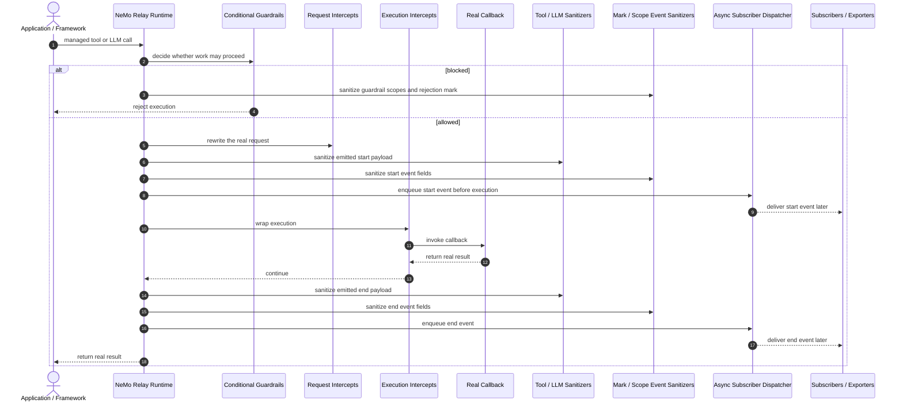
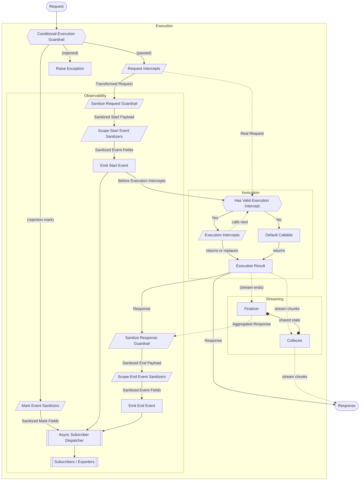

import { MermaidStyles } from "@/components/MermaidStyles";

{/* SPDX-FileCopyrightText: Copyright (c) 2026, NVIDIA CORPORATION & AFFILIATES. All rights reserved.
SPDX-License-Identifier: Apache-2.0 */}

This page explains the runtime behavior that runs around managed tool and LLM
calls and sanitizes emitted mark and scope events.

## What Middleware Is

Middleware controls or transforms tool and LLM execution and sanitizes emitted
events. NeMo Relay applies each surface at a specific lifecycle point.

Middleware is organized by lifecycle meaning rather than as one undifferentiated
hook system.

## Asynchronous Callbacks

All middleware families accept asynchronous callbacks. Rust callbacks return a
future; Python callbacks may return a value or an awaitable; and Node callbacks
may return a value or a Promise. Relay awaits entries sequentially in priority
order, so later callbacks observe earlier middleware output.

Managed execution and standalone conditional/request-intercept helpers are
asynchronous because their result depends on middleware completion. Manual
lifecycle APIs (`tool_call`, `tool_call_end`, `llm_call`, and `llm_call_end`)
remain synchronous: they create or close their handle immediately and queue
observability work rather than awaiting it.

## Registration Levels

Middleware and subscribers can be registered at different levels depending on their
lifetime and visibility.

### Global Registrations

Global registrations stay active for the whole process until they are removed.
Use them for defaults that should apply broadly.

### Scope-Local Registrations

Scope-local registrations are owned by one active scope and disappear
automatically when that scope closes.

Use them when behavior should stay local to one request, workflow, or nested
unit of work.

### Plugin-Installed Registrations

Plugins can install middleware during initialization. This is the reusable,
configuration-driven path for shipping middleware bundles without hand-registering
everything in application code.

## Middleware Families

NeMo Relay has two major middleware families:

- **Intercepts** change the real execution path
- **Guardrails** block work or rewrite emitted observability payloads

## Intercepts

Intercepts are middleware that change the real request or execution path.

### Request Intercepts

Request intercepts rewrite the real request before execution continues.

Use them when the next stage of execution should receive changed input, such as:

- Header injection
- Request normalization
- Argument enrichment
- Provider-specific request rewriting

### Execution Intercepts

Execution intercepts wrap or replace the real callback.

Use them when behavior belongs around the invocation boundary itself, such as:

- Retries
- Timing
- Routing
- Wrapper logic
- Framework integration

### Stream Execution Intercepts

LLM streaming has a stream execution path for wrappers that need to run around
chunk delivery and finalization rather than only around a single response
object.

## Guardrails

Guardrails are middleware that block execution or sanitize observability payloads.

### Conditional Execution

Conditional-execution guardrails run before the real callback. They decide
whether execution may proceed.

Use them when the runtime should block work based on policy, budget, or context.

### Sanitize Request

Sanitize-request guardrails rewrite the payload recorded on emitted start events.

Use them when the event stream should hide or reduce sensitive request data.

### Sanitize Response

Sanitize-response guardrails rewrite the payload recorded on emitted end events.

Use them when the event stream should hide or reduce sensitive response data.

### Sanitize Mark and Scope Events

Event sanitizers cover observability fields that are outside the specialized
tool and LLM payload APIs. Separate registries apply to marks, scope starts,
and scope ends. They can rewrite `data`, `category_profile`, and `metadata`
while receiving the complete event as immutable context.

Scope event sanitizers run for every category. On tool and LLM scope events,
they run after the specialized request or response sanitizer. Mark sanitizers
cover explicit marks and marks materialized by middleware, plugins, and
streaming lifecycle helpers.

Register event sanitizers globally, on an owning scope, or through a plugin
context. For the callback contract and binding APIs, refer to
[Event Sanitizers](/reference/event-sanitizers).

Sanitize guardrails are observability-oriented. They do not rewrite the real
arguments passed to the callback or the real value returned to the caller.

## Queued Event Publication

Scope operations, marks, and manual tool/LLM lifecycle calls never become
awaitable because an event sanitizer is asynchronous. At emission time Relay
snapshots the event, visible sanitizer chain, and subscribers, then places the
work on a serial dispatcher. The dispatcher awaits sanitizers and publishes the
event later in FIFO order.

Subscriber and exporter delivery is therefore delayed, while start/end/mark
order is preserved. Closing a scope or deregistering middleware after emission
does not affect queued snapshots. Sanitizer failures fail open: Relay records
the callback failure and publishes the last valid event snapshot.

## Managed Execution Order

For managed execution, NeMo Relay applies middleware and emits lifecycle events
in this order:



1. Conditional-execution guardrails
2. Request intercepts
3. Tool or LLM sanitize-request guardrails
4. Scope-start event sanitizers and start-event emission
5. Execution intercepts
6. The real callback, unless an execution intercept replaces it
7. Tool or LLM sanitize-response guardrails
8. Scope-end event sanitizers and end-event emission

For streaming LLM flows, the same pre-execution order applies: the runtime
applies `sanitize-request` guardrails and emits the LLM start event before the
stream execution intercept chain runs. Stream execution intercepts are the
execution family for streaming provider callbacks. The runtime then collects
chunks and finalizes the stream before `sanitize-response` guardrails rewrite
the emitted end-event payload and scope-end event sanitizers run at items 7 and
8.

This ordering is what makes the semantic split between intercepts and
guardrails important:

- If you need to change the real execution path, use an intercept
- If you need to change only the emitted payload, use a sanitize guardrail

Before LLM request sanitizers run, Relay removes standard credential headers
from the event-only request copy: `authorization`, `proxy-authorization`,
`cookie`, `x-api-key`, `api-key`, `anthropic-api-key`, and `x-goog-api-key`.
Header-name matching is case-insensitive. This protects sanitizer callbacks,
subscribers, and exporters without changing the request sent to the provider.
Configure a PII sanitizer for custom credential header names.

## Codec-Aware LLM Sanitizers

Every LLM sanitize guardrail receives the payload first and a required
directional, per-call context second:

```text
request:  (LlmRequest, LlmSanitizeRequestContext) -> Option<LlmRequest>
response: (Json, LlmSanitizeResponseContext) -> Option<Json>
```

`context.codec` is a binding-native codec identity, not a JSON payload.
Python and Node.js expose `kind` and, when applicable, `id` properties.
In-process Rust and the typed native Rust SDK expose enum variants. The raw
native ABI exposes the same information through `codec_kind` and `codec_id`.

`codec.kind` is `none` for a call with no codec, `builtin` for
Relay's built-in `openai_chat`, `openai_responses`, and `anthropic_messages`
codecs, `runtime` for a named runtime-registered codec, and `opaque` for an
active codec without a registered identity. `codec.id` is present only for
`builtin` and `runtime`. Do not infer a provider from an opaque request shape.

Return a payload to continue the sanitizer chain. Return `None` (or `null` in
JavaScript) only when observing the payload would be unsafe: Relay omits the
LLM event payload and its annotation, while leaving the client-visible request
and response unchanged. Omission short-circuits later LLM sanitizers.

All LLM sanitizer callbacks must implement this two-parameter contract. For an
in-process sanitizer, use `resolve_codec()` to access the active codec
implementation. A resolver returns no codec for manual calls without one.
Worker-plugin contexts resolve to an invocation-scoped asynchronous proxy with
the same directional operations: request codecs provide `decode(request)` and
`encode(annotated, original)`, while response codecs provide `decode(response)`.
Python in-process response codecs expose that operation as `decode_response`,
and Node.js exposes it as `decodeResponse`. An active runtime or opaque codec
resolves just like a built-in codec; its identity does not limit the available
operations. Node.js codecs supplied through decode and encode callbacks have
an `opaque` identity but remain resolvable. The worker proxy is valid only
while its sanitizer callback is running; do not retain it after the callback
returns.

<Tabs>
<Tab title="Python" language="python">

```python
import nemo_relay
from nemo_relay import LLMRequest
from nemo_relay import guardrails

def redact_request(
    request: LLMRequest,
    context: nemo_relay.LlmSanitizeRequestContext,
) -> LLMRequest | None:
    codec = context.resolve_codec()
    if (
        context.codec.kind == "builtin"
        and context.codec.id == "openai_chat"
        and codec is not None
    ):
        annotated = codec.decode(request)
        # Apply a policy to the normalized request, then preserve the wire shape.
        annotated.messages = []
        return codec.encode(annotated, request)
    return request

guardrails.register_llm_sanitize_request("redact-openai-chat", 10, redact_request)
```

</Tab>
<Tab title="Node.js" language="javascript">

```js
const relay = require("nemo-relay-node");

relay.registerLlmSanitizeRequestGuardrail(
  "redact-openai-chat",
  10,
  (request, context) => {
    const codec = context.resolveCodec();
    if (codec) {
      const annotated = codec.decode(request);
      annotated.messages = [];
      return codec.encode(annotated, request);
    }
    return request;
  },
);
```

</Tab>
<Tab title="Rust" language="rust">

```rust
use std::sync::Arc;
use nemo_relay::api::runtime::{BuiltinLlmCodec, LlmCodecIdentity};
use nemo_relay::api::registry::register_llm_sanitize_request_guardrail;

register_llm_sanitize_request_guardrail(
    "redact-openai-chat",
    10,
    Arc::new(|mut request, context| {
        if context.codec() == &LlmCodecIdentity::BuiltIn(BuiltinLlmCodec::OpenAiChat)
            && let Some(codec) = context.resolve_codec()
            && let Ok(mut annotated) = codec.decode(&request)
        {
            annotated.messages.clear();
            request = codec.encode(&annotated, &request).ok()?;
        }
        Some(request)
    }),
)?;
```

</Tab>
</Tabs>

The same registration names support scope-local and plugin-context
registrations. Priority and name tie-break ordering are unchanged.

## Detailed Execution Flow

<MermaidStyles />

The simplified sequence above is the right mental model for most readers. The
diagram below expands the same flow to show where guardrail rejections, event
subscribers, execution-intercept chaining, and streaming collection/finalization
fit into the runtime path.



## Choosing the Right Surface

Use these comparisons to pick the middleware surface that matches the behavior you need.

- Use a **conditional-execution guardrail** when the work should be allowed or
  rejected.
- Use a **request intercept** when the real request must change before the call.
- Use an **execution intercept** when behavior belongs around the invocation
  boundary.
- Use a **sanitize guardrail** when only subscribers and exporters should see
  rewritten data.
- Use a **mark or scope event sanitizer** when the sensitive fields are in
  `data`, `category_profile`, or `metadata` rather than the managed tool or LLM
  request/response payload.
- Use a **stream execution intercept** when you need streaming-specific
  behavior applied across the lifecycle of a long-lived or chunked response,
  such as per-chunk transformation, incremental authorization, logging or
  metrics per event, backpressure handling, or cancellation and cleanup,
  rather than an execution intercept that only surrounds a single call
  boundary.

## Practical Guidance

Use these practices when applying the concept in application or integration code.

- Keep process-wide defaults global.
- Keep request-local policy scope-local.
- Use plugins when the middleware bundle should be reusable and
  configuration-driven.
- Treat execution intercepts as the preferred wrapper point for framework
  integrations.
